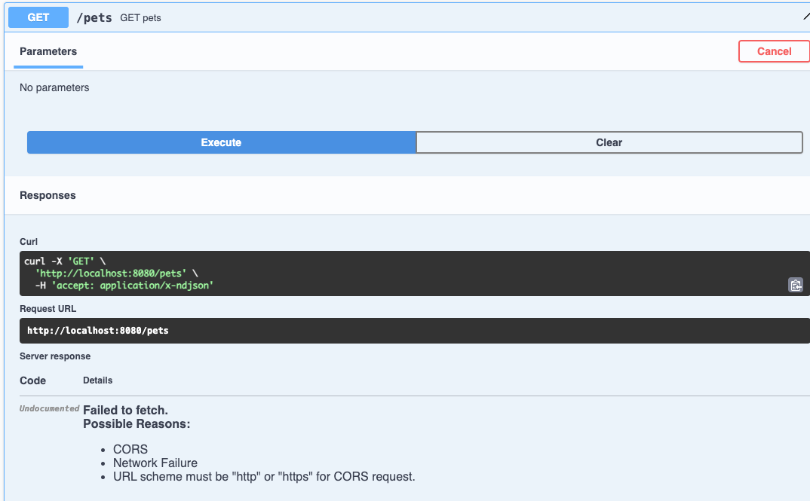

### Minor issue SELF_001

```text
WARN[0000] Found orphan containers ([rabbitmq mongo-db]) for this project. If you removed or renamed this service in your compose file, you can run this command with the --remove-orphans flag to clean it up. 

WARN[0000] Found orphan containers ([self-improvement-service]) for this project. If you removed or renamed this service in your compose file, you can run this command with the --remove-orphans flag to clean it up. 
```

https://stackoverflow.com/questions/50947938/docker-compose-orphan-containers-warning


### Major issue SELF_002

```text
When I try to execute any requests from swagger, the response didn't fetch in swagger, but in app log appears the execution of request, 
which means that the problem could be on communication level
```

Maybe could be the solution:
* https://springdoc.org/#swagger-ui-properties
* https://github.com/springdoc/springdoc-openapi/issues/1775

